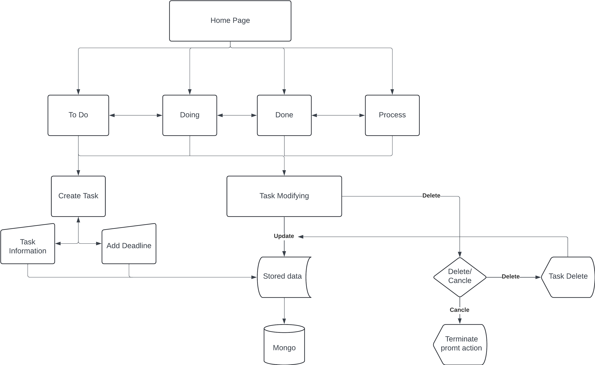

# **KANBAN-PROJECT-GROUP-5**

### Group Members
 
- Sergio Lopez
- Quang Le
- Anthony Nunez
- Elton Tran
 
### Project Requirements 

- []
- []
- []

### Software Requirement Specifications

### Scrum update @ 16th February
For the first week meeting, we get to know about each other as well as the project concept and requirements. During the meeting, we decided that I (Sergio) will be the scrum master, Quang will help on creating the flow chart diagram, while Anthony and Elton will work on creating the GitHub repository. Next step, we planning on coming up with the basic framework of the software and begin looking at similar projects on GitHub. 

## Group project flow-chart

The website will follow the basic process of a task management application. Users will have the ability to create tasks, as well as modify and delete the task of their work along the process. Each action will be update and store in the online ope scorce database.

### Scrum update @ 23th Feb
## Change after discussion
The second week start with a small change in the position and roll of each member. Sergio will be the main person in coding and holding the github respository. Quang still responsible for drawing the flowchart diagram, thus, helping with maintain the github scrum and support Sergio of gathering coding example for the project (both from the class and online open sources). 
From this week on till the 12th April, the project mainly around coming up  with the code prototype, building up the back-end and front-end structure for the application, and trying to connect the app with Mongo database. 
We are following the 4 weeks update duration, plus an extra week of midterm exam, and a spring break in the first week of April. 
Anthony and Elton will support Sergio to complete the coding section.

### Scrum update @ 12 April
This week we have already obtain most of the fundamental element of the application. However, the project's code are currently facing challenges connection with Mongo through docker, which is a crucial point to manage the task and action of the user. The team also having some man-power issue as Elton has been hositalized for his lung's diagnostic.